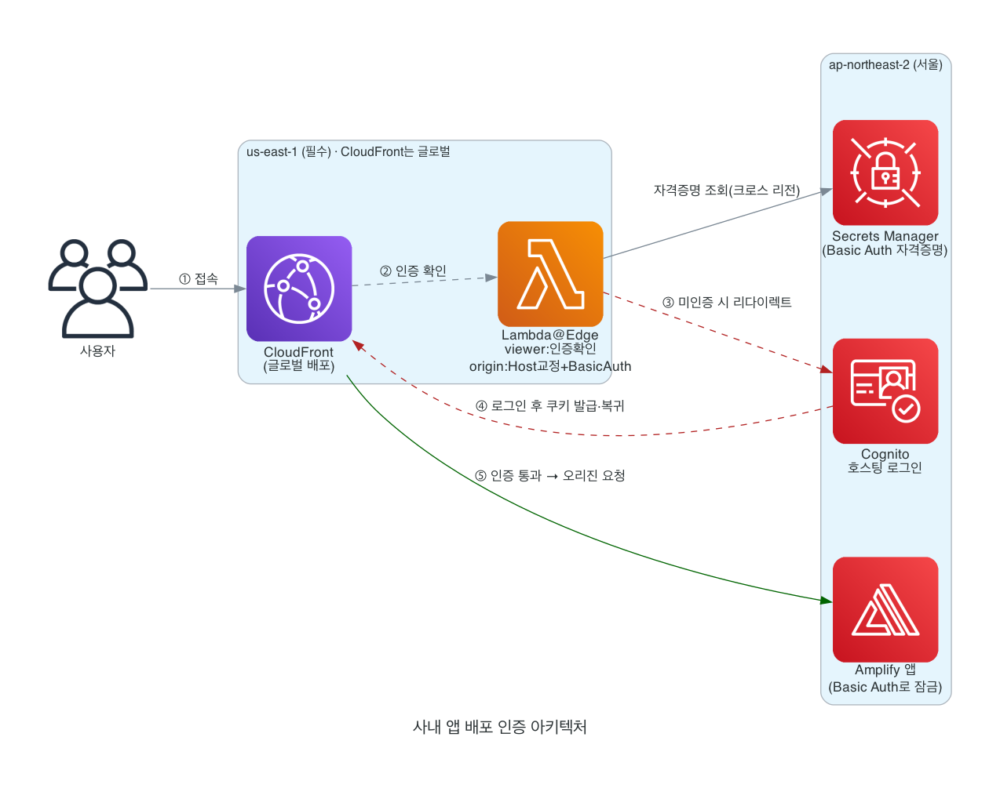

# 전체 그림 이해하기

구축을 시작하기 전에 전체 구조와 핵심 개념을 이해합니다.

## 아키텍처

**요청 흐름**

1. 사용자가 **CloudFront 주소**로 접속
2. CloudFront가 **Lambda@Edge(viewer-request)** 로 인증 확인
3. 미인증이면 **Cognito 호스팅 로그인 페이지**로 리다이렉트
4. 로그인 성공 시 인증 쿠키 발급 후 원래 주소로 자동 복귀
5. 인증 통과 시 **Lambda@Edge(origin-request)** 가 Host 헤더 교정 + Secrets Manager의 Basic Auth 주입 후 **Amplify 앱**(Basic Auth로 잠금)으로 오리진 요청

## 꼭 이해할 것 3가지

**1. 대문 페이지를 직접 만들지 않습니다.**
Cognito가 호스팅하는 로그인 페이지가 대문입니다. 미인증 사용자는 자동으로 로그인 페이지로 이동하고, 로그인 성공 시 원래 주소로 자동 복귀합니다.

**2. 앱 코드는 한 줄도 수정하지 않습니다.**
인증은 엣지 서버(Lambda@Edge)에서 실행됩니다.

> ⚠️ 이전에 브라우저 게이트 스크립트(방식 ①)를 `index.html`에 넣었다면 **반드시 제거**하세요. 남아 있으면 로그인이 이중으로 걸립니다.

**3. Amplify 원래 주소로 우회 접속하면 차단됩니다.**
`...amplifyapp.com` 주소는 Basic Auth(401)로 잠급니다. 사용자는 CloudFront 주소로만 접속합니다.

## 핵심 개념: Lambda@Edge 함수 하나가 두 시점에 동작

| 트리거 | 역할 | 제약 |
|---|---|---|
| **viewer-request** | 모든 요청에서 Cognito 인증 확인 (미인증 → 로그인으로 리다이렉트) | Host 헤더 읽기 전용 |
| **origin-request** | Amplify로 나가기 직전 **Host 헤더 교정 + Basic Auth 주입** | Host 수정 가능 |

> ★ 가장 중요한 교훈: viewer-request에서 인증만 하면 오리진으로 갈 때 Host가 CloudFront 도메인이라 **Amplify가 403을 냅니다.** 그래서 같은 함수를 두 트리거에 모두 연결합니다.

## 리전 배치

| 리소스 | 리전 | 비고 |
|---|---|---|
| **Lambda@Edge 함수 + IAM 역할** | **us-east-1 (버지니아)** | ⚠️ **필수** — Lambda@Edge는 us-east-1에서만 생성 가능 |
| CloudFront | 글로벌 | 리전 개념 없음 (콘솔은 us-east-1 화면에서 관리) |
| Amplify | **ap-northeast-2 (서울)** | 리전 서비스 |
| Cognito | **ap-northeast-2 (서울)** | 리전 서비스 |
| Secrets Manager | **ap-northeast-2 (서울)** | Lambda@Edge가 SDK에서 리전을 지정해 조회 (us-east-1 불필요) |

> ⚠️ **us-east-1에 만드는 것은 Lambda@Edge 함수(+IAM 역할)뿐입니다.** 나머지(Amplify·Cognito·Secrets Manager)는 모두 **ap-northeast-2(서울)** 에 만듭니다.
>
> - Lambda@Edge 코드에서 Secrets Manager·Cognito 클라이언트의 `region`을 `ap-northeast-2`로 지정하면 크로스 리전으로 정상 동작합니다. (한국 사용자 기준 서울 리소스라 오히려 지연이 낮습니다)
> - 각 STEP 상단에 표시된 리전으로 콘솔 우측 상단을 맞추고 진행하세요.
